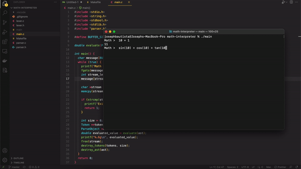

To run the Math Interpreter, compile the project first using `make`:

```
make
```

After which, run the executable:

```
./main
```

Two ways to exit the REPL:

1. type `exit`; or
2. hit `ctrl + z` or `cmd + .`


