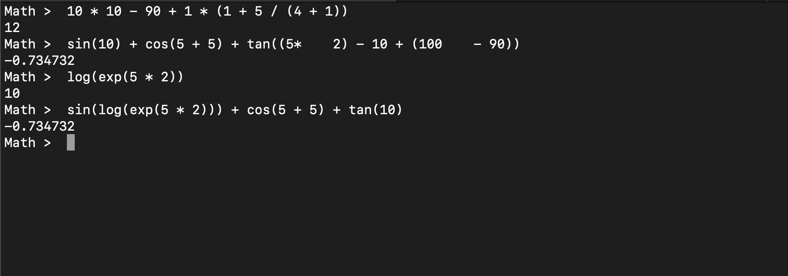

To run the Math Interpreter, compile the project first using `make`:

```
make
```

After which, run the executable:

```
./main
```

Two ways to exit the REPL:

1. type `exit`; or
2. hit `ctrl + z` or `cmd + .`



Grammar Rules:

```
<expr> ::= <expr> + <term> |
           <expr> - <term> |
           <term>

<term> ::= <term> * <factor> |
           <term> / <factor> |
           <factor>

<factor> ::= (<expr>) |
             <trigOp>(<expr>) |
             <expOp>(<expr>) |
             number

<trigOp> ::= sin | cos | tan

<expOp> ::= exp | log | ln
```
